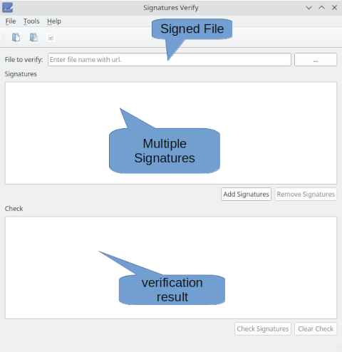

# PySigVi
Simple Gui to verify file signatures with GPG - The GNU Privacy Guard.

PySigVi is a GUI (Graphical User Interface) for [GNU Privacy Guard GPG](https://gnupg.org/).

It checks the detached signatures of a file.

Under the hood it repeat:

*gpg --verify detached_signature file_to_verify*

for each detached signature.

PySigVi does not create the signatures! It only checks the existing ones created with some other software.

## Installation
**For windows user:**

+ download the [latest release](https://github.com/pysimone/PySigVi/releases/latest) of *pysigvi-installer.exe*
+ run *pysigvi-installer.exe* to install PySigVi in your system
+ launch PySigVi from the menu of Windows or double-clicking the icon in the
    desktop

or

+ download the [latest release](https://github.com/pysimone/PySigVi/releases/latest) of *pysigvi.exe*
+ execute *pysigvi.exe* to run PySigVi without installing it in your system

**For linux user:** 

+ download the [latest release](https://github.com/pysimone/PySigVi/releases/latest) of *pysigvi*
+ execute *sudo install ./pysigvi /usr/bin/* to install PySigVi in your system
+ execute *pysigvi* ro run PySigVi

or

+ make *pysigvi* executable with *chmod a+x pysigvi*
+ execute *./pysigvi* to launch PySigVi without installing it in your system

##Usage (fast version)##

+ Click the button with the three dots.
+ Select the file you want to verify the signatures.
+ Click "Add Signatures".
+ Select the signatures.
+ Click on "Check Signatures" to verify the signature of the file.
+ Look at the "Check" field.
+ If everything is green the file is correctly signed!
